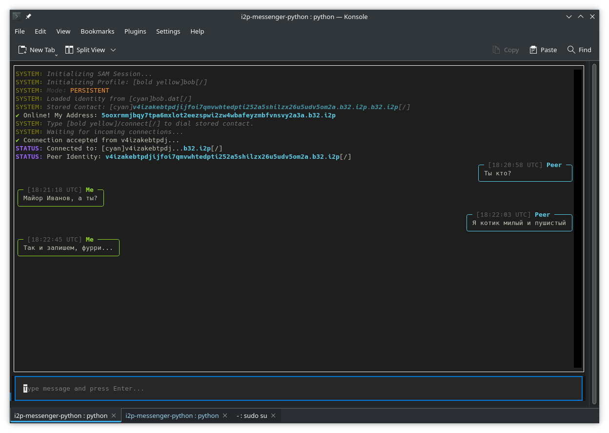
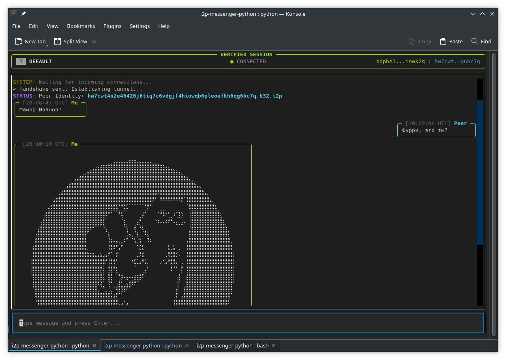

## TermchatI2P: Децентрализованный защищенный мессенджер

TermchatI2P — это консольный (TUI) мессенджер, работающий через анонимную сеть **I2P (Invisible Internet Project)**. Проект ориентирован на максимальную приватность, исключая центральные сервера и метаданные.




## 🚀 Быстрый старт

### Предварительные требования
1.  **I2P Роутер:** На вашем компьютере должен быть запущен I2P роутер (Java I2P или i2pd).
2.  **SAM интерфейс:** Убедитесь, что в настройках роутера включен протокол SAM (обычно порт `7656`).
3.  **Python version > 3.9, 3.14 preferred** и установленные зависимости:
    ```bash
    pip install i2plib textual rich
    ```

### 🐍 Настройка окружения (Python 3.14 + venv)

Для изоляции зависимостей и корректной работы мессенджера рекомендуется использовать виртуальное окружение.

#### Установка Python 3.14 (если не установлен)
1. Установка uv
```bash
curl -LsSf https://astral.sh/uv/install.sh | sh
```
2. Создание окружения с ПРАВИЛЬНОЙ версией одной командой
```bash
uv venv --python 3.14 i2p_env
```
3. Активация

```bash
source i2p_env/bin/activate
```


### Запуск
Для запуска мессенджера используйте команду:
```bash
python chat.py [имя_профиля]
```

Если имя_профиля не указано, приложение запустится в Transient (временном) режиме — ваш адрес будет меняться при каждом перезапуске.
Если указать имя (например, python chat.py alice), создастся файл alice.dat, который сохранит ваш постоянный адрес I2P.

🛠 Управление в приложении

    Связь с контактом: Введите /connect <адрес.b32.i2p> в поле ввода.
    Быстрое подключение: Если в файле профиля (вторая строка .dat файла) сохранен адрес друга, введите /connect без аргументов.
    Выход: Нажмите Ctrl+Q или просто q.

### 🔒 Анализ безопасности и сравнение

TermchatI2P спроектирован с упором на архитектуру **Zero-Trust** (нулевое доверие). Ниже приведено сравнение с популярными защищенными мессенджерами.


| Функция | Telegram (Secret) | Signal | TermchatI2P (I2P) |
| :--- | :---: | :---: | :---: |
| **Центральный сервер** | Да | Да | **Нет (P2P)** |
| **Скрытие IP-адреса** | Нет | Нет | **Да (По умолчанию)** |
| **Привязка к номеру** | Да | Да | **Нет (Анонимно)** |
| **Метаданные** | Хранятся на сервере | Минимум | **Отсутствуют** |
| **Устойчивость к цензуре** | Высокая | Высокая | **Абсолютная** |

---

### 🛡️ Изолированный подход (Compartment Approach)

TermchatI2P реализует архитектуру **"один пользователь — один ключ"**, также известную как метод разделения (compartmentalization). В отличие от традиционных мессенджеров, здесь безопасность строится не вокруг платформы, а вокруг каждой отдельной сессии.

#### Почему это превосходит другие архитектуры?

1. **Полная изоляция (Compartmentalization):**
   В обычных мессенджерах (Telegram, Signal) ваш аккаунт — это единая точка отказа. Если скомпрометирован номер телефона или доступ к серверу, злоумышленник видит все ваши контакты и метаданные. В TermchatI2P вы можете иметь 10 разных профилей (`.dat` файлов) для 10 разных собеседников. Компрометация одного ключа никак не влияет на безопасность остальных.

2. **Отсутствие глобального идентификатора:**
   Здесь нет общего реестра пользователей. Ваша личность существует только в рамках пары ключей. Это исключает возможность "Correlation Attacks" (атак через сопоставление данных), так как внешнему наблюдателю невозможно доказать, что два разных адреса принадлежат одному и тому же человеку.

3. **Локальный контроль над "Доверием":**
   В этой архитектуре сервер не является "доверенной стороной", потому что его просто не существует. Вы сами решаете, кому разрешить подключение (через `stored_peer` в файле профиля). Это превращает ваше устройство в неприступную крепость, которая игнорирует любые запросы извне, кроме тех, что подписаны доверенным ключом.

4. **Защита от массовой слежки:**
   Традиционные системы безопасности (даже с E2EE) уязвимы к анализу графа связей. I2PChat разбивает этот граф на мелкие, несвязанные сегменты. Даже обладая неограниченными ресурсами, спецслужбы не могут построить карту ваших контактов, так как каждый профиль — это "цифровой призрак".

> **Итог:** Это не просто мессенджер, а инструмент для создания независимых каналов связи, где каждая пара собеседников живет в своей собственной зашифрованной вселенной.


## Основные функции

### Обмен текстовыми сообщениями

Пользователи могут отправлять и получать текстовые сообщения в
реальном времени. Сообщения отображаются в виде «пузырей» (message
bubbles) в терминальном интерфейсе.

Каждое сообщение имеет:

- уникальный идентификатор (`MSG_ID`)
- отметку времени (UTC)
- подтверждение доставки

---

### Подтверждение доставки

После получения сообщения клиент отправляет подтверждение доставки.

Это позволяет отправителю увидеть индикатор доставки рядом с
сообщением в интерфейсе.

---

### Передача изображений

Клиенты могут отправлять изображения напрямую через соединение.

Передача выполняется поэтапно:

1. отправка заголовка изображения
2. передача данных по частям (chunks)
3. завершение передачи

После получения изображение автоматически сохраняется и отображается
в терминале.

Режимы отображения:

- нативный рендеринг терминала (если поддерживается)
- ASCII/Braille рендеринг для обычных терминалов

---

### Передача файлов

Поддерживается отправка произвольных файлов между пользователями.

Файлы передаются по частям, что позволяет передавать большие объёмы
данных без перегрузки соединения.

Полученные файлы сохраняются в локальной директории клиента.

---

### Сквозное шифрование (E2E)

Все пользовательские данные могут передаваться с использованием
сквозного шифрования.

Это означает, что:

- сообщения шифруются на стороне отправителя
- расшифровываются только на стороне получателя
- промежуточные узлы сети не имеют доступа к содержимому

---

### Используемые алгоритмы

Для реализации E2E используются следующие криптографические примитивы:

| Назначение | Алгоритм |
|-------------|-----------|
| Обмен ключами | X25519 |
| Шифрование | ChaCha20-Poly1305 |
| Проверка целостности | Poly1305 (в составе AEAD) |
| Генерация ключей | HKDF |

---

### Локальное хранилище

Приложение использует изолированную директорию пользователя:
```bash 
~/.termchat-i2p/
```

В ней хранятся:

- профили и ключи пользователя
- полученные изображения
- полученные файлы
- служебные данные приложения

---

### Архитектурные особенности

Протокол разработан с учётом будущих возможностей:

- оффлайн сообщений
- распределённых «dead-drop» хранилищ
- репликации данных между узлами
- расширения типов сообщений

Это позволяет постепенно развивать систему без изменения базового
протокола.


## 📝 Инструкция по использованию

*   Если **имя_профиля** не указано, приложение запустится в **Transient** (временном) режиме — ваш адрес будет меняться при каждом перезапуске.
*   Если указать имя (например, `python chat.py alice`), создастся файл `alice.dat`, который сохранит ваш постоянный адрес I2P.

### 🛠 Управление в приложении

*   **Связь с контактом:** Введите `/connect <адрес.b32.i2p>` в поле ввода.
*   **Быстрое подключение:** Если в файле профиля (вторая строка `.dat` файла) сохранен адрес друга, введите `/connect` без аргументов.
*   **Выход:** Нажмите `Ctrl+Q` или просто `q`.

## Протокол обмена сообщениями

Приложение использует лёгкий бинарный протокол кадров (framed protocol) для
надёжной передачи данных по постоянному потоку (например, через I2P SAM).

Протокол предназначен для:

- обмена текстовыми сообщениями
- передачи файлов и изображений
- уведомлений о доставке
- устойчивости к рассинхронизации потока
- дальнейшего расширения (например, офлайн-сообщений)

---

### Структура кадра

Каждое сообщение передаётся как бинарный кадр:

```
MAGIC | VERSION | TYPE | MSG_ID | LEN | PAYLOAD
```


### Размеры полей:

| Поле | Размер | Описание |
|-----|------|-------------|
| MAGIC | 4 байта | Маркер кадра для синхронизации (`0x89 49 32 50`) |
| VERSION | 1 байт | Версия протокола |
| TYPE | 1 байт | Тип сообщения |
| MSG_ID | 8 байт | Уникальный идентификатор сообщения |
| LEN | 4 байта | Размер полезной нагрузки |
| PAYLOAD | переменный | Содержимое сообщения |

---

### Сообщения

| Тип | Описание |
|----|-----------|
| `U` | Текстовое сообщение пользователя |
| `D` | Уведомление о доставке |

---

### Служебные сообщения

| Тип | Описание |
|----|-----------|
| `P` | Ping |
| `O` | Pong |
| `S` | Сигналы управления |

Пример сигнала:


```bash
__SIGNAL__:QUIT
__SIGNAL__:TYPING
```


---

### Передача файлов

Передача файлов выполняется в три этапа:

| Тип | Описание |
|----|-----------|
| `F` | Начало передачи файла (`имя|размер`) |
| `C` | Блок данных (base64) |
| `E` | Завершение передачи |

---

### Передача изображений

Изображения передаются аналогично файлам:

| Тип | Описание |
|----|-----------|
| `M` | Начало передачи изображения |
| `C` | Блок данных изображения |
| `I` | Завершение передачи |

---

### Устойчивость к рассинхронизации

Каждый кадр начинается с маркера `MAGIC`, что позволяет получателю
восстановить синхронизацию потока в случае повреждения данных.

---

### Транспорт

Протокол работает поверх потокового соединения (TCP-подобного),
например через сеть I2P.

Надёжность доставки и порядок сообщений обеспечиваются
транспортным уровнем.


